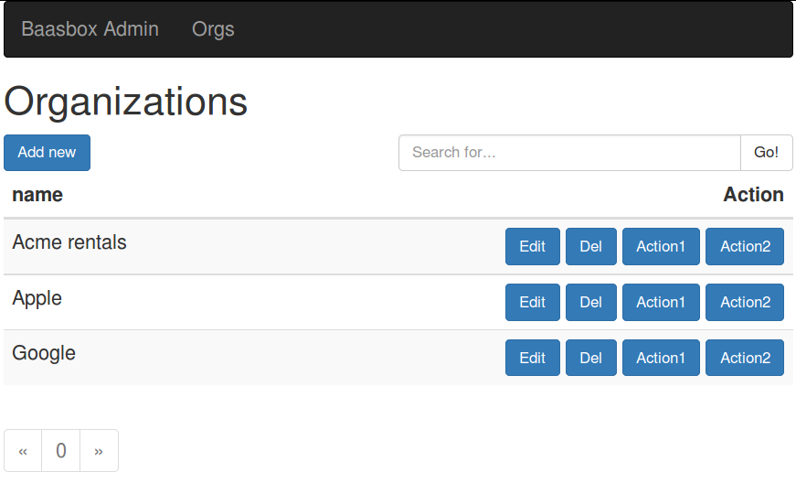

# BaasBox admin web component

A web application that uses the ```data-table``` HTML 5 web component that can be used to create admin tools for BaasBox documents. The web application can be hosted, or executed locally (unhosted) by simply opening the ```public/index.html``` file. This project is based off the [Web App Skeleton project][webapp_skeleton] (see that project for more details on the technologies used).



# Features

- Add, edit, delete documents on a BaasBox server
- Paging and searching for documents
- Upload images to documents
- Upload GPS co-ordinates using Open Street Map markers
- Can be run locally, wrapped into an app, or hosted as a static site

# Usage

- From your BaasBox backend, add a collection called ```Organization```, to try out the sample code.
- Run ```bower install``` in the ```public``` directory to install the required dependencies. 
- Edit the ```public/js/config.js``` with the correct details for your BaasBox server.
- Open the ```public/index.html``` in your browser
- Click the *Organizations* link and play with the tool to see how it works

The code for the Organizations tool is in ```public/activities/organizations/organizations.html```

# HTML 5 web components

The core of the functionality is provided by the [data-table][] web component. This can be used independently in other projects. It depends on [Polymer][] for the web components shim as well as data binding, and [Bootstrap][] for UI layout. 

The [input-location][] web component provides a rudimentary GPS co-ordinates input field by integrating with [Open Street Map][osm].

Sample usage:
```html
<!-- HTML 5 import of data-table web component (in HEAD section) -->
<link rel="import" href="/elements/data-table/data-table.html"/>

<!-- Create admin tool for the "Organization" collection, and sort by it's "name" field -->
<data-table model="Organization" orderBy="name">
</data-table>
```

The BaasBox server credentials are read from a global ```config.baasbox``` variable, which can be initialized as follows:

```javascript
window.config = {
   'baasbox': {
      'url': 'http://localhost:9000',
      'appcode': '1234567890',
      'username': 'admin',
      'password': 'admin'
   }
}
```

The above allows *listing* and *deleting* the items. In order to be able to *add* or *edit* an item, you need to provide an edit form in a ```template``` tag as the first child of the ```data-table``` element, e.g.

```html
<data-table model="Organization" orderBy="name">
  <template>
    <form>
      <input type="text" id="name" placeholder="Organization name" value="[[m.name]]"/>
      
      <button onClick="[[cancel]]">Cancel</button>
      <button onClick="[[submit]]">Submit</button>
    </form>
  </template>
</data-table>
```

Note the use of the double-square-bracket syntax ```[[m.name]]```, which prevents collision with the templating engine's (Nunjucks) own Mustache-like syntax.

Sometimes, you will want to provide additional actions to perform on an item. For that, you can supply the ```onAction``` attribute as well as the ```actions``` attribute:

```html
<data-table model="Organization" orderBy="name" actions="Action1 Action2" onAction="onAction">
</data-table>

<script>
  function onAction(operation, model) {
    if (operation === "Action1") {
       // do something with model
    } else if (operation === "Action2") {
       // do something else with model
    }
  }
</script>
```

For a more detailed example, see the [Organizations example][org_example]

Attributes that the ```data-table``` element accepts:

- ```model```: name of the collection on the BaasBox server
- ```cols```: space-separated list of columns (fields) to display in the list. Default is "name".
- ```where```: a where clause for the BaasBox query, e.g. ```where="name like 'Apple'"```
- ```orderBy```: the orderBy clause for the BaasBox query, e.g. ```orderBy="name desc"```
- ```actions```: space-separated list of actions for each item, e.g. ```actions="Action1 Action2"```. These appear as buttons on each row.
- ```onAction```: a javascript function to call when an action button is clicked. The function is passed the action name (string) and the model object as parameters.

# Development

In order to create more admin pages for the documents in your BaasBox server:

- Add a new activity in the ```public/activities/``` directory (copy & paste the organizations one)
- Add links to the activity in ```public/templates/navbar_main``` and ```public/activities/default/default.html```

# Known Issues

- Tested in Firefox only!
- No login form, the credentials are hard-coded into the *config.js* file

 [webapp_skeleton]: https://github.com/tobykurien/webapp_skeleton
 [Polymer]: http://www.polymer-project.org/
 [Bootstrap]: http://getbootstrap.com/
 [osm]: http://www.openstreetmap.org/
 [data-table]: https://github.com/tobykurien/baasbox_admin/tree/master/public/elements/data-table
 [input-location]: https://github.com/tobykurien/baasbox_admin/tree/master/public/elements/input-location
 [org_example]: https://github.com/tobykurien/baasbox_admin/tree/master/public/activities/organizations


